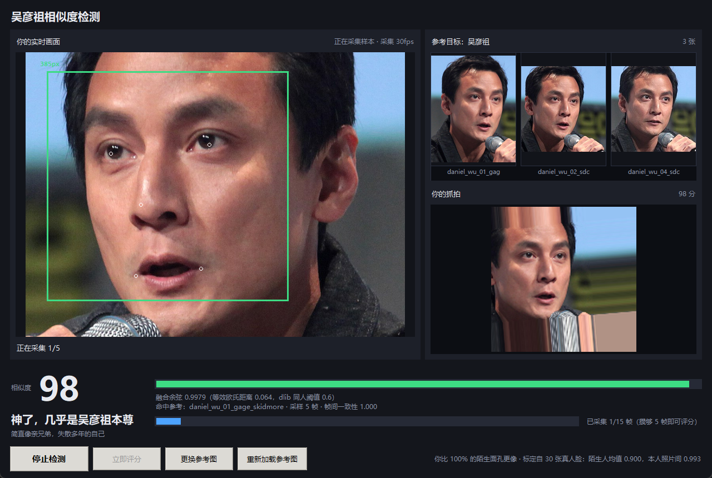

# 吴彦祖相似度检测

一个 Windows 桌面小工具：**左边**调用摄像头拍你，**右边**显示吴彦祖的照片，
然后用人脸识别算法给出两者的相似度分数和一句评价。



---

## 1. 快速开始

```bash
# 1) 安装依赖（dlib 在 Windows 上走预编译包 dlib-bin，不需要编译工具链）
pip install -r requirements.txt

# 2) 运行
python run.py
```

点「开始检测」→ 正对摄像头 → 攒够样本后点「立即评分」。

> 换参考图：点「更换参考图」选一个**目录**（可以放多张同一个人的照片，算法会自动做多图融合）。
> 目录里非正面/太糊的照片会被自动剔除，控制台会打印剔除原因。

---

## 2. 算法是怎么做的

### 2.1 整体流程

```
摄像头原始帧
   │
   ├─ 缩到 ≤640px ──→ HOG 人脸检测 ─────────────→ 候选框（每帧都跑，~110ms）
   │                        │
   │              框坐标换算回原始帧
   │                        │
   │              裁出人脸 + 统一放大到 224px   ← 关键：让网络输入尺度与
   │                        │                     人脸在画面里的大小无关
   │              68 点关键点
   │                        │
   │              姿态 / 亮度 / 清晰度 门控 ──→ 不合格就提示用户调整
   │                        │ 合格
   │              dlib ResNet 128 维描述子 ──→ 连续采 N 帧，逐维取中位数
   │                                              │
   └──────────────────────────────────────────────┤
                                                  ▼
参考图库（多张）──→ 各自算描述子 ──→ 1:N 检索，取 top-K 融合
                                                  │
                                        原始余弦相似度
                                                  │
                                    用真实标定曲线映射成 0-100
```

### 2.2 关键技术点

**姿态归一化分两层做，职责要分清。**
dlib 的 `compute_face_descriptor()` 内部会用 68 个关键点做 `get_alignment_proper`
对齐，所以**不要**再自己把脸裁成 150×150 送进去。实测过：先手工裁剪的话，
同一人的两两余弦会从 **0.996 掉到 0.98**，自一致性反而变差。
本项目只对「给人看的预览图」做手工对齐，打分一律走 dlib 原生路径。

**分析前统一裁剪缩放，让输入尺度与画面里的脸大小无关。**
dlib 的关键点/描述子模型是在「人脸约 100-200px」这个尺度上训练的。
如果直接丢整帧，用户离镜头远近一变，关键点精度和分数都会跟着抖。
所以检测在降采样帧上跑（快），分析时再从**原始帧**裁出人脸、
统一缩放到 `FACE_ANALYSIS_SIZE=224`。这也是为什么"脸在画面里 80px 还是 300px"
都能稳定评分 —— 尺寸门控只用来提示用户靠近，不影响精度。

**分数不是拍脑袋给的系数。**
直接拿余弦当百分比没有意义（dlib 描述子之间余弦普遍在 0.85-1.0）。
本项目用 **30 张真实公众人物照片**当"冒名者"样本，统计他们与吴彦祖参考图库的
余弦分布，再据此设定锚点做分段线性映射：

| 锚点 | 余弦 | 分数 | 含义 |
|---|---|---|---|
| 冒名者中位数 | 0.9023 | 40 | 比一半陌生面孔更像 |
| 冒名者 P95 | 0.9219 | 62 | 比 95% 陌生面孔更像 |
| 本人照片 P05 | 0.9878 | 88 | 达到本人不同照片的典型水平 |

所以分数可以读作「**你比多少比例的陌生面孔更像**」，有实际参照系。
实测分布：本人照片 93-99 分，30 张陌生人 38-63 分，**两个分布完全不重叠**
（同人下限 0.9868 vs 冒名上限 0.9256）。

**参考图库要自检，否则会被一张"其实是别人"的照片带偏。**
实际踩到的坑：从一张合影里自动挑人脸，挑中了旁边的人，那张"吴彦祖参考照"
其实是冒名者。现在 `Matcher.validate_gallery()` 会做两道检查 ——
两两余弦 < 0.90 判定不是同一人并剔除，> 0.995 判定是同一张图的重复。

**多图 top-K 融合，而不是只挑一张。**
单张参考照容易受拍摄角度/光线影响。程序对每张参考照算 1:N 检索分，
再取最高的 K 张求均值（`REFERENCE_TOP_K`，默认 2），稳健性更好。

**连续多帧取中位数。**
摄像头每帧都有噪声。攒够 5 帧才允许评分，池子上限 15 帧，
逐维取**中位数**（不是均值，抗单帧异常）再归一化。

**打分前先卡画质。**
侧头、转头、低头、太暗、糊、脸太小，这 6 类都会被挡在门外并给出具体提示。
这不只是 UX —— 姿态不正时描述子本身就不稳定，采进去只会污染分数。

### 2.3 性能

| 环节 | 单帧耗时（CPU，实测） |
|---|---|
| HOG 人脸检测（480px / 640px） | ~60 ms / ~110 ms |
| 68 点关键点 | ~2 ms |
| 128 维描述子 | **~265 ms**（不随分辨率变化） |

描述子很贵，所以两条通路分开节流：检测每帧都跑（负责画框），
描述子按 `EMBED_INTERVAL_MS`（默认 400ms）节流采样。
摄像头在独立线程抓帧，UI 线程 33ms 刷新，推理不会卡住界面。

---

## 3. 目录结构

```
run.py                      程序入口
facecmp/
  config.py                 所有可调参数（阈值、采样策略、评价文案）
  engine.py                 dlib 封装：检测 / 关键点 / 描述子 / 画质评估
  scoring.py                相似度打分 + 标定曲线 + 参考图库自检
  session.py                实时状态机（找脸 → 采样 → 可评分 → 评分）
  camera.py                 线程安全的摄像头封装
  reference.py              参考图库加载
  app.py                    Tkinter 界面
  assets/
    reference/              吴彦祖参考照（来自 Wikimedia Commons）
    calibration/            标定数据（冒名者描述子 + 映射锚点）
tools/                      构建与测试脚本（见下）
```

## 4. 工具脚本

| 脚本 | 作用 |
|---|---|
| `build_impostors.py` | 下载 19 位公众人物照片，抽取 30 个描述子做标定集（支持断点续跑） |
| `rebuild_labels.py` | 缓存丢失后，从 `impostor_meta.json` 重建标签文件 |
| `expand_references.py` | 补充更多吴彦祖正面照 |
| `build_calibration.py` | 统计冒名者分布，生成 `calibration.json` |
| `inspect_gallery.py` | 检查参考图库：逐张画质指标 + 两两相似度，找重复图/错人图 |
| `explain_reject.py` | 逐张打印检测框与画质指标，排查某张为什么被门控拦下 |
| `test_overlay_coords.py` | 回归测试：画框用的坐标必须真的是"显示帧坐标"（见下） |
| `test_similarity.py` | 验证相似变换的闭式解与暴力数值优化一致（详见下） |
| `smoke_e2e.py` | 不依赖摄像头的端到端冒烟测试 |
| `smoke_gui.py` | 用注入帧驱动真实 GUI 回调，产出界面截图 |
| `smoke_camera.py` | 真实摄像头跑完整流程 |
| `capture_launch.py` | 真实启动 `run.py` 并截启动画面 |
| `check_preview.py` / `check_overlay.py` | 检查对齐图与检测框是否真的落在人脸上 |
| `compare_paths.py` | 对比三种描述子提取路径的一致性（用来得出"别手工对齐"这个结论） |

重新标定（比如你换了参考图）：

```bash
python tools/build_calibration.py
```

## 5. 测试

```bash
python tools/test_similarity.py      # 几何变换正确性（与暴力优化对比）
python tools/test_overlay_coords.py  # 画框坐标是否落在人脸上
python tools/inspect_gallery.py      # 参考图库自检
python tools/smoke_e2e.py            # 端到端逻辑
python tools/smoke_gui.py            # GUI 回调链路
```

### 关于坐标系

检测跑在降采样帧上，但 `session` 对外暴露的东西（`face.box`、`face.landmarks`、
`boxes`）**统一是原始帧 = 界面显示帧坐标**，界面只做一次"缩放 + 居中偏移 + 左右镜像"。
这条约定很脆：中间曾经把 `boxes` 留在分析帧坐标、`face.box` 留在原始帧坐标，
界面又按分析帧再乘一次缩放比，于是框被重复缩放、和人脸对不上
（960 宽摄像头配 `ANALYSIS_WIDTH=640`，`kx=1.5`，框直接大 1.5 倍并错位）。
关键点还踩过第二次：裁剪块的坐标要靠裁剪的 `origin`/`scale` 还原到原图，
不能套用"分析帧→原始帧"的缩放比，两者毫无关系。

`tools/test_overlay_coords.py` 就是防这两类 bug 的：不复用被测代码，
自己在测试里重写一遍裁剪+映射的数学，再和 `session` 的输出比对
（最大偏差 < 8px；把 scale 取反或漏加 offset 会产生 100~500px 偏差），
另外还检查关键点的几何关系（眼在鼻上、鼻在嘴上、嘴在下巴上、眼距占脸宽 0.2~0.6）
和 `boxes` 与 `face.box` 的 IoU。

### 相似变换的坑

人脸对齐用的 Umeyama 相似变换有三个极易写错的点 ——
协方差漏掉 `1/n` 归一化（尺度会恰好放大 n 倍）、旋转矩阵写成 `USVᵀ` 而不是 `VSᵀ`、
以及 `cv2.warpAffine` 配合 `WARP_INVERSE_MAP` 时矩阵方向的约定。
这类 bug 在图片上的表现是"对齐到了旁边的背景"，肉眼很难发现。
`tools/test_similarity.py` 用构造的真值（已知缩放/旋转/平移）+ Nelder-Mead
暴力搜索做基准逐例比对，残差要求达到机器精度量级（1e-26），
同时检查矩阵不含错切。

## 6. 素材来源与免责

参考照来自 Wikimedia Commons，均为自由授权：

| 文件 | 来源 | 许可 |
|---|---|---|
| `daniel_wu_01_gage_skidmore.jpg` | [Daniel Wu by Gage Skidmore](https://commons.wikimedia.org/wiki/File:Daniel_Wu_by_Gage_Skidmore.jpg) | CC BY-SA 3.0 |
| `daniel_wu_02_sdcc2015.jpg` | [SDCC 2015 - Daniel Wu (19113652353)](https://commons.wikimedia.org/wiki/File:SDCC_2015_-_Daniel_Wu_(19113652353).jpg) | CC BY-SA 2.0 |
| `daniel_wu_04_sdcc2015_alt.jpg` | [SDCC 2015 - Daniel Wu (19546544250)](https://commons.wikimedia.org/wiki/File:SDCC_2015_-_Daniel_Wu_(19546544250).jpg) | CC BY-SA 2.0 |
| `daniel_wu_03_alive.jpg` | [Alive Daniel Wu](https://commons.wikimedia.org/wiki/File:Alive_Daniel_Wu.jpg) | CC BY-SA 2.5 |

> `daniel_wu_03_alive.jpg` 是侧脸照，程序会自动把它剔除出评分图库（控制台会打印原因），
> 保留在目录里只是留个记录。

标定用的冒名者样本来自其他公众人物的 Wikimedia 肖像照，程序只保存了 128 维描述子，未保留原图。

**本项目仅供娱乐和技术演示。** 分数由通用人脸识别模型给出，
只反映脸部几何特征的接近程度，不代表任何身份认同，也不应用于身份识别、
安防、考勤等任何需要可靠身份判定的场合。
